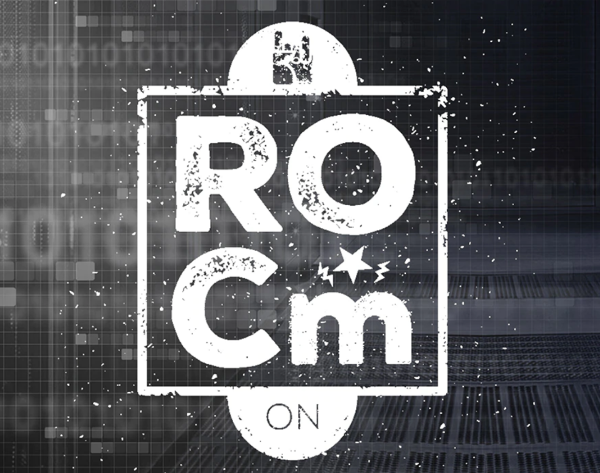
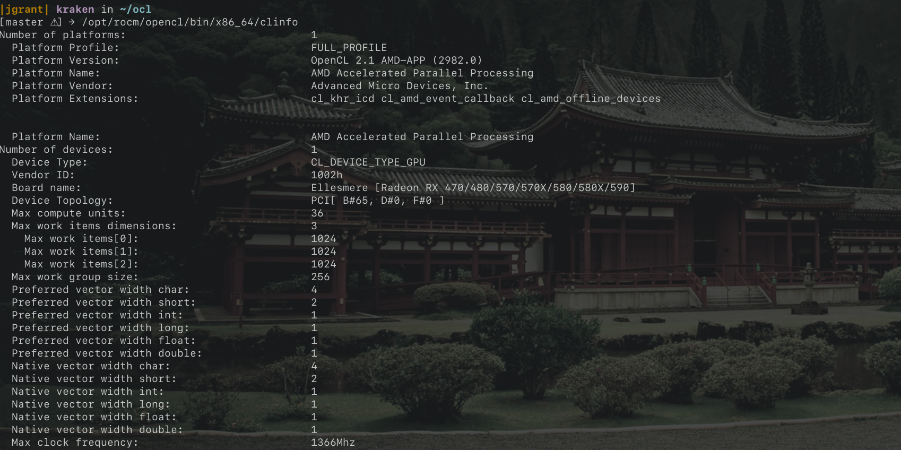

# AMD ROCm OpenCL installer for Ubuntu / POP OS 19.x

[Radeon Open Compute platform](https://rocm.github.io) installation for Ubuntu based distros using their own kernel 5.0 AMDGPU modules.

### What is ROCm

_... the first open-source HPC/Hyperscale-class platform for GPU computing that’s also programming-language independent. We are bringing the UNIX philosophy of choice, minimalism and modular software development to GPU computing. The new ROCm foundation lets you choose or even develop tools and a language run time for your application._

_ROCm is built for scale; it supports multi-GPU computing in and out of server-node communication through RDMA. It also simplifies the stack when the driver directly incorporates RDMA peer-sync support._

_ROCm has a rich system run time with the critical features that large-scale application, compiler and language-run-time development requires._

_HSA Compliant Runtime and Driver for AMD RADEON GPU’s_

### Instructions

Use `install_rocm_opencl.sh` to install and follow the reboots at the commented out lines in the file.

After the final reboot run `test_rocm_opencl.sh` to verify the install (See screenshot).

